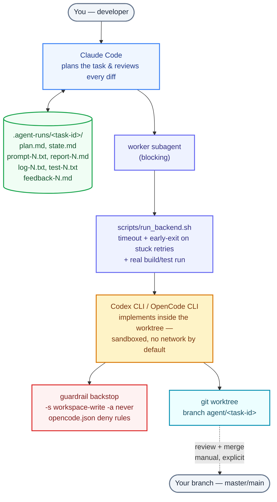
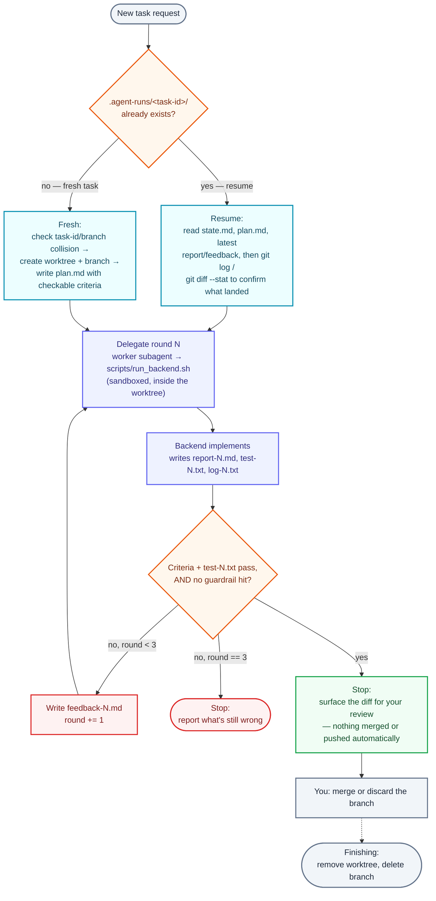
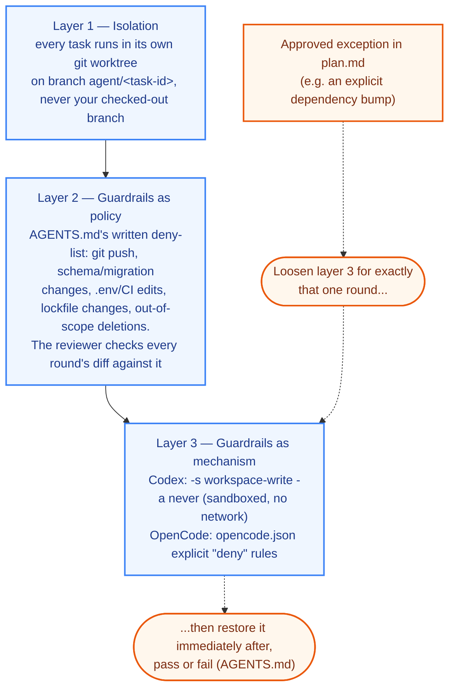

# zoro

**A Claude Code skill that turns "implement this feature" into a supervised
pipeline instead of a single unattended agent run.**

Claude Code plans the work and reviews every diff; [Codex CLI](https://github.com/openai/codex)
and/or [OpenCode CLI](https://opencode.ai) do the actual editing, as
non-interactive subprocesses running in an isolated git worktree. Nothing
lands on your branch until you've seen the diff, nothing gets pushed or
merged without you saying so, and if Claude's context runs out mid-task —
or a backend hits its usage limit — the task doesn't die with the session.
It's picked up cold by whichever tool is free next.

## Why this exists

Point a coding agent at a real task and two problems show up quickly:

- **Long tasks outlive a single context window.** A multi-round
  implement/review loop on a non-trivial feature can run past what one
  Claude session, or one `codex exec`/`opencode run` invocation, can hold —
  and when it does, the natural failure mode is losing track of what was
  tried, what's left, and why.
- **"Autonomous" and "trusted with `git push`" are different claims.** An
  agent that's genuinely useful unattended (workspace-write, no approval
  prompts) is also one you'd rather not hand your remote, your `.env`, or
  your lockfiles to by accident — especially a smaller/free model, which
  (per testing this skill's guardrails against) doesn't reliably know when
  to stop retrying something it's not allowed to do.

zoro's answer to both: **put every fact about a task's progress in plain
files, not in a conversation**, and **make the dangerous stuff structurally
hard to do by accident**, so any backend can resume the same task with zero
shared memory, and none of them can quietly do something you didn't approve.

## How it works



Every fact about a task — the plan, each round's prompt, its report, its
test output, what failed and why — is written to `.agent-runs/<task-id>/` as
plain numbered files, not held only in whichever CLI is currently running.
That's what makes the loop resumable: a fresh Claude session, a direct
`codex exec`, or `opencode run` can read `state.md`, `plan.md`, and the
latest report/feedback and continue exactly where the task left off — see
[Switching backends mid-task](#switching-backends-mid-task).

### Task lifecycle

What actually happens between "describe a feature" and "diff ready for
review," round by round:



## Prerequisites

- Claude Code, with skills enabled.
- At least one of `codex` (Codex CLI) or `opencode` (OpenCode CLI) installed
  and authenticated. The setup step checks that the binary runs and that the
  CLI flags the templates use still exist on your installed version — it
  can't confirm you're logged in, so do that yourself first.
- A git repository to run it in. New or existing, empty or established — the
  setup step inspects whatever's there rather than assuming.

## Install

Clone this repo, then copy (or symlink) the `zoro` skill folder into your
personal skills directory:

```sh
git clone <this-repo-url>
cd <cloned-folder>
cp -r skills/zoro ~/.claude/skills/
```

Some other CLIs are converging on a shared `~/.agents/skills/` directory as a
cross-runtime alias for skills — check your specific CLI's docs to confirm it
actually reads that path before relying on it, since (unlike `AGENTS.md`
itself) this isn't a universally documented convention yet:

```sh
cp -r skills/zoro ~/.agents/skills/
```

## Use

In any project, ask Claude Code to set up the harness — "set up the harness
here", "set up codex+claude for this repo" — or invoke the `zoro` skill
directly. It will:

1. Check that `codex` and/or `opencode` are installed, and sanity-check that
   the flags the templates use still exist on your installed version.
2. Inspect the target repo for real build/test commands — these get run
   after every implementation round to verify a diff, not just documented.
3. Write `AGENTS.md`, `CLAUDE.md`, `.claude/settings.json`,
   `.claude/agents/worker.md`, `scripts/resume.sh`, `scripts/run_backend.sh`,
   `opencode.json`, and a `.agent-runs/` entry in `.gitignore`, filled in for
   that project, and show them to you before doing anything else.

From then on, describing a feature or fix is enough to kick off the loop —
Claude slugs it into a task, plans it, and delegates. Nothing about it needs
to look different from asking Claude to do the work directly; the harness is
what runs underneath.

### What gets written where

```
<your repo>/
├── AGENTS.md                    # cross-backend context, guardrails, resumability protocol
├── CLAUDE.md                    # Claude-specific orchestration loop
├── opencode.json                # OpenCode's own deny-list backstop
├── .claude/
│   ├── settings.json
│   └── agents/worker.md         # blocking subagent that drives one round
├── scripts/
│   ├── run_backend.sh           # wraps a backend call: early-exit + real test run
│   └── resume.sh                # hand a stuck task to a different backend
└── .agent-runs/<task-id>/       # gitignored — one directory per task
    ├── worktree/                # isolated checkout, branch agent/<task-id>
    ├── plan.md                  # acceptance criteria, written once
    ├── state.md                 # status, round, progress log, next step
    ├── prompt-N.txt             # exact prompt sent to the backend, round N
    ├── report-N.md              # what changed and why, round N
    ├── log-N.txt                # raw stdout/stderr, round N
    ├── test-N.txt               # real build/test output, round N
    └── feedback-N.md            # what's wrong and what to fix, round N
```

## Guardrails — keeping autonomous runs from doing something you didn't want

Three layers, so no single flag or forgotten check leaves you exposed:



1. **Isolation.** Every task runs in its own `git worktree` on branch
   `agent/<task-id>` — never your checked-out branch. You always get a diff
   to review, never a change that already happened.
2. **A written deny-list.** `AGENTS.md` lists what no backend may do without
   you naming it explicitly in that task's `plan.md` first: `git push`/
   force-push, schema or migration changes, editing `.env`/CI config,
   touching lockfiles or dependency versions, deleting anything out of scope.
   The reviewing backend checks every round's diff against this list, not
   just against the task's stated acceptance criteria.
3. **Enforced at the tool level too.** Codex runs with
   `-s workspace-write -a never` — sandboxed to the worktree, network access
   off by default, so a stray `git push` has nowhere to go. OpenCode runs
   with `opencode.json`'s explicit `"deny"` rules for the same patterns —
   `opencode run --auto` is designed to only auto-approve what would
   otherwise prompt, never to override an explicit `"deny"` rule (observed
   holding in testing at the time this was built; re-verify if OpenCode's
   permission behavior ever changes underneath you).

None of this stops you from approving something on that list yourself — via
`AGENTS.md`'s "Approved exceptions to the guardrails" process, which loosens
layer 3 for exactly one named round and restores it immediately after. It
stops something from happening *without* you noticing, not from happening at
all once you've said yes.

Every round also runs through `scripts/run_backend.sh`, which adds two things
a bare CLI call doesn't give you: it kills a round early if the backend gets
stuck retrying the same denied action instead of waiting out the full
timeout, and it runs the project's real build/test commands afterward so a
round is graded on `test-N.txt`, not on the backend's own claim that things
work.

## Switching backends mid-task

When Claude hits its usage limit (or any backend does) partway through a
task, don't re-explain anything — run:

```sh
scripts/resume.sh opencode   # or: codex / claude
```

It finds the in-progress task under `.agent-runs/`, reads its `state.md`
(what's done, what's left, the exact next step), and launches the new backend
with that context handed to it directly. The new backend also reads
`AGENTS.md` automatically on startup (Codex and OpenCode both honor it, the
same way Claude honors `CLAUDE.md`), which carries the full resumability
protocol — so it knows to check `.agent-runs/` before doing anything else even
if you invoke it without the script.

## Finishing up

Once you've decided what to do with a task's branch — merge it or discard it
— clean up with `git worktree remove .agent-runs/<task-id>/worktree` and
`git branch -d agent/<task-id>`. Nothing does this automatically, on purpose:
the worktree is the only copy of a round's work until it's actually merged.
The task directory itself (`plan.md`, `state.md`, the numbered
prompt/report/feedback/log/test files) is safe to leave in place afterward —
it's `.gitignore`d, small, and doubles as a record of what was tried if the
same task comes back.

## Design notes / FAQ

**Why a git worktree per task instead of just branching?** A worktree gives
the backend its own working directory on disk, so it can't accidentally
touch files you have open or uncommitted changes on your current branch —
isolation that a plain `git checkout -b` inside your existing checkout
doesn't give you.

**Why not just trust the sandbox flags and skip the written guardrail list?**
Because they protect against different failures. The sandbox (`-s
workspace-write -a never`, `opencode.json`'s deny rules) stops a backend from
doing something *by itself*; the written list is what the reviewing backend
checks a diff against, which catches a sandboxed-but-still-wrong change (e.g.
an edit that's technically inside the worktree but violates scope). Neither
one alone is the full picture — see [Guardrails](#guardrails--keeping-autonomous-runs-from-doing-something-you-didnt-want).

**Why does a denied edit need special handling instead of just failing?**
Because a small/free model doesn't reliably treat a permission denial as "stop
and report" — it can retry the identical blocked action repeatedly instead,
burning a round's entire time budget on nothing. `scripts/run_backend.sh`
watches for that pattern and kills the round early rather than waiting out
the full timeout for a result that was never coming.

**What happens after round 3 if a task still hasn't passed?** The loop stops
and tells you what's still wrong rather than continuing indefinitely —
`state.md` stays at whatever round it reached so you (or a human-driven
follow-up) can pick it up manually.

See [`skills/zoro/SKILL.md`](skills/zoro/SKILL.md) for the full process and
the `.agent-runs/` handoff protocol.
